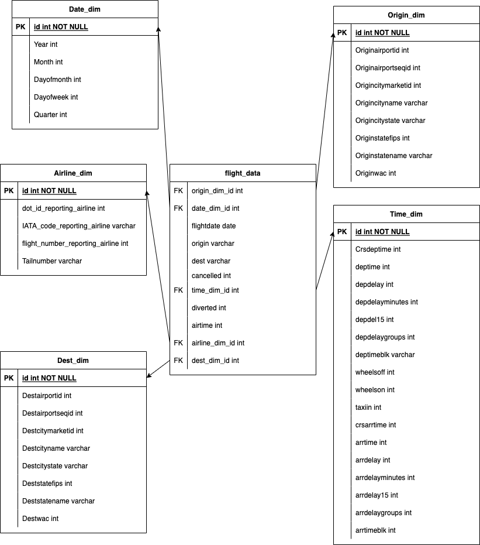

# Flight Data Analysis with Metabase, Jupyter Notebook, and PostgreSQL

This repository contains a Docker Compose file that sets up a complete environment for analyzing data using Metabase, Jupyter Notebook, and PostgreSQL. The dataset used in this project includes flight information such as flight name, time, arrival, destination, and several other features.

## Setup

Steps to replicate the analysis
1. Clone the repository:
```git clone git@github.com:kailasprasannakumar/airline_data.git```
2. Change directory to the `docker` folder:
```cd airline_data/docker```
3. Start the docker container
    ```docker compose up -d```
4. Copy the jupyter token using the command  ```docker logs jupyter```
5. Connect to [http://localhost:8888](http://localhost:8888)
6. Copy the Airline Data in the following directory -  bi_project/jupyter/jovyan/
7. Run ```airline_data.ipynb``` to transfer the clean and transfer the data to the mentioned postgres database
8. After successfully running the ETL process, execute the bash script to obtain additional KPIs: ```/bin/bash db_kpi.sh```
9. Metabase KPI Queries:
The queries for creating KPIs in Metabase can be found in the `metabase_kpi.sql` file.

## Star Schema

The analysis is based on a star schema, which can be found in the following image: 


Happy analyzing! :airplane: :chart_with_upwards_trend:
